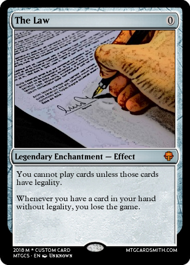
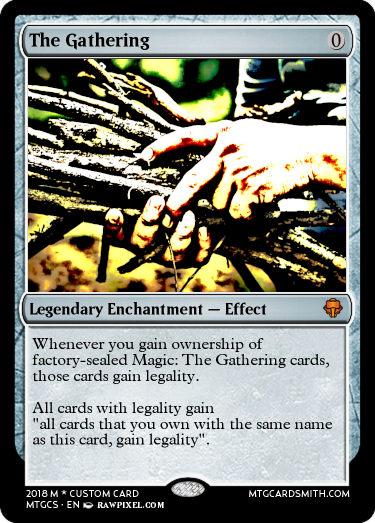
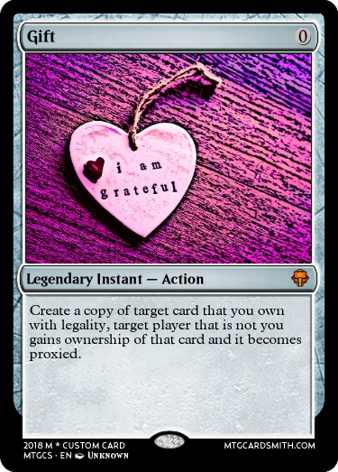
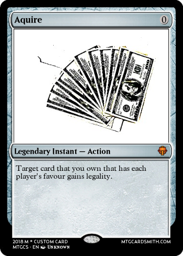

# Filthy Casual, a Magic: The Gathering Format

A format for Magic: The Gathering.

## The Spirit of the rules 
The format is deigned to encourage trading and casual play among members without players resorting to building predesigned meta decks. Players in good faith must stick to the intention and spirit of these rules.

## Rulings
All players in the format always own all action and effect cards.  
Effect cards are permanently in play they cannot be removed from play.  
Action cards can be played at any time, they cannot be countered.
It's up to each individual player to keep track of the legality of their cards.
Thre results of action and effect cards persist after a Magic: The Gathering game is over.

The format adds the following cards:

  

  

  
